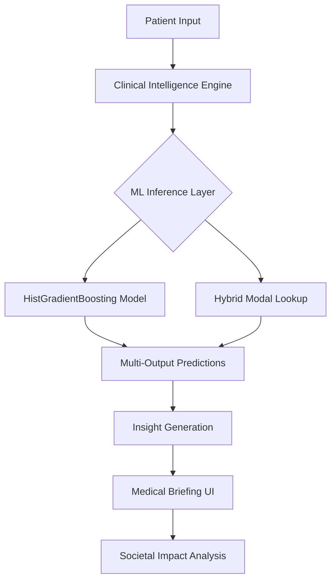
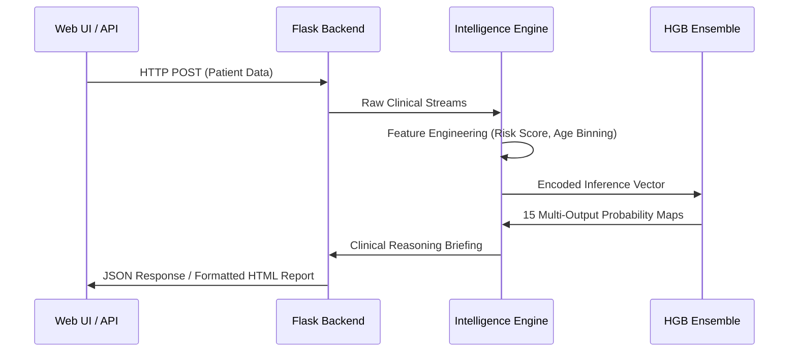

# 🏗️ AmrLens AI - System Architecture

This document describes the technical implementation and logical flow of the AmrLens AI Antibiotic Resistance Prediction engine.

## 1. High-Level Flow
The application follows a **Modular Machine Learning Pipeline** architecture, ensuring a clear separation between data preprocessing, model inference, and clinical reasoning.

## 2. The 3-Layer Pipeline

### Layer 1: Data Signal Processing (`src/clean.py`)
- **Provenance**: Data aggregated from [Mendeley Data](https://data.mendeley.com/datasets/ccmrx8n7mk/1) and [Kaggle](https://www.kaggle.com/datasets/adilimadeddinehosni/multi-resistance-antibiotic-susceptibility).
- **Noise Reduction**: Standardizes mixed-format resistance data.
- **Feature Interaction**: Calculates `ClinicalRiskScore` and `ComorbidityIndex` to provide a holistic patient profile.
- **Persistent Encoding**: Uses a saved `souches_mapping.pkl` to maintain consistency between microbial IDs across training and production.

### Layer 2: Machine Learning Ensemble (`src/train.py`)
- **Algorithm**: `HistGradientBoostingClassifier` (Multi-Output). 
- **Learning Logic**: The model is trained on cross-antibiotic correlations, meaning it learns to predict resistance for one drug based on the known patterns of others.
- **Optimization**: Uses early stopping and permutation importance for feature selection.

### Layer 3: Reasoning & Insight Engine (`app.py`)
- **Clinical Insight Generator**: A rule-based engine that converts raw probability scores into human-readable medical briefings.
- **Scalability Layer**: A RESTful JSON API (`/api/predict`) allowing integration with external hospital management systems.

## 3. Data Flow Diagram

## 4. Scalability & Deployment
- **Portability**: The entire system is container-ready, with an automated bootstrap pipeline that regenerates models if missing.
- **Extensibility**: The model architecture supports the addition of genomic (SNP/K-mer) data without restructuring the primary Flask logic.
